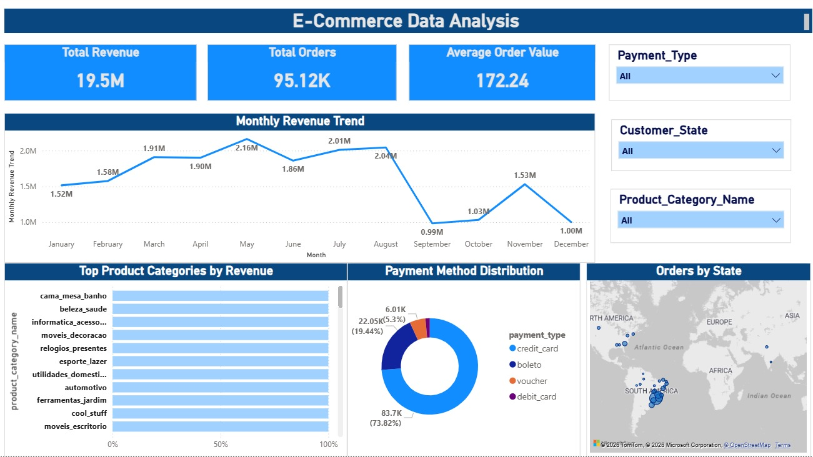

# E-Commerce Business Data Analysis

## 📊 Project Overview

This project analyzes an e-commerce dataset to understand sales performance, product trends, and customer purchasing behavior. The goal is to extract meaningful business insights using **SQL, Python, and Power BI** and present them through an interactive dashboard.

The project follows an end-to-end data analysis workflow including data extraction, cleaning, exploratory data analysis (EDA), and dashboard visualization.

---

## 🎯 Objectives

* Analyze revenue trends over time
* Identify top performing product categories
* Understand geographic distribution of customers
* Evaluate payment method preferences
* Calculate key business metrics such as revenue and average order value

---

## 🗂 Dataset Description

The dataset contains information about e-commerce transactions including:

* Order details
* Customer location
* Product categories
* Payment information
* Shipping costs

After cleaning and filtering, the analysis includes **113,383 delivered orders**.

---

## 🛠 Tools & Technologies

The following tools were used in this project:

* **SQL (MySQL)** – Data extraction and relational joins
* **Python**

  * Pandas – Data manipulation
  * Matplotlib & Seaborn – Data visualization
* **Power BI** – Interactive dashboard creation
* **Jupyter Notebook** – Exploratory data analysis

---

## 📈 Key Business Metrics

| Metric              | Value   |
| ------------------- | ------- |
| Total Revenue       | ~$19.5M |
| Total Orders        | ~95K    |
| Average Order Value | ~$172   |

---

## 📊 Exploratory Data Analysis

### Monthly Revenue Trend

Sales were analyzed over time to identify seasonal patterns and revenue growth.

Key observation:

* Revenue increased significantly during late **2017**, likely due to **holiday promotions and Black Friday sales**.

---

### Top Product Categories

The highest revenue generating categories include:

1. Bed, Bath & Table
2. Health & Beauty
3. Electronics Accessories
4. Home Decoration
5. Watches & Gifts

These categories contribute a large portion of the platform's total revenue.

---

### Geographic Sales Distribution

Customer demand is heavily concentrated in **Brazil's southeastern region**.

Top states by orders:

* São Paulo (SP)
* Rio de Janeiro (RJ)
* Minas Gerais (MG)

São Paulo alone contributes a large share of total sales.

---

### Payment Method Analysis

The majority of transactions were completed using:

* Credit Card
* Boleto
* Voucher
* Debit Card

Credit cards represent the dominant payment method.

---

## 📊 Power BI Dashboard

An interactive dashboard was built to visualize key insights including:

* Revenue KPIs
* Monthly sales trends
* Top product categories
* Geographic order distribution
* Payment method breakdown

Dashboard Preview:



---

## 📁 Project Structure

```
ecommerce-data-analysis
│
├── data
│   ├── raw
│   └── processed
│        ecommerce_final.csv
│
├── sql
│   analysis_queries.sql
│
├── notebooks
│   ecommerce_analysis.ipynb
│
├── powerbi
│   ecommerce_dashboard.pbix
│
├── images
│   dashboard.png
│
└── README.md
```

---

## 🚀 How to Run the Project

1. Clone the repository

```
git clone https://github.com/yourusername/ecommerce-data-analysis.git
```

2. Open the notebook

```
notebooks/ecommerce_analysis.ipynb
```

3. Open the Power BI dashboard

```
powerbi/ecommerce_dashboard.pbix
```

---

## 📌 Key Insights

* Total revenue exceeded **$19M** across ~95K completed orders.
* Average customer spending per order was approximately **$172**.
* **São Paulo** generated the highest number of orders and revenue.
* Home and lifestyle product categories dominate the marketplace.
* Sales show strong seasonal spikes during major promotional periods.

---

## 👨‍💻 Author

SATYA MANIKANTA REDDY

Aspiring Data Analyst with experience in:

* SQL
* Python (Pandas, Matplotlib, Seaborn)
* Power BI
* Data Visualization
* Business Analytics

---

## 📬 Contact

LinkedIn: www.linkedin.com/in/satyamanikantareddy
Email: shanmukareddy1999@gmail.com

---
